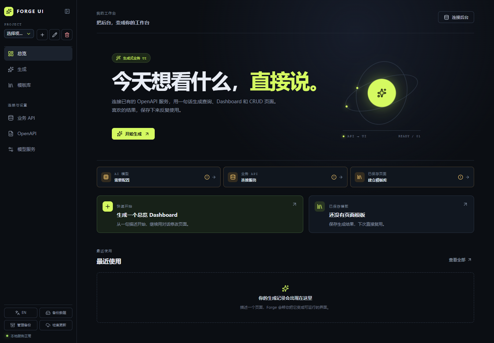
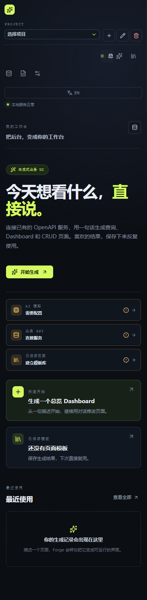

<div align="center">

# Forge UI

**把已有的 OpenAPI 服务，变成可运行、可复用的业务工作台。**

连接业务 API，用一句自然语言生成受控的查询、Dashboard 与 CRUD 页面；页面结构由 `PageSpec` DSL 校验并由本地客户端执行。

[中文](#chinese) | [English](#english) · [产品需求](docs/PRD.md) · [设计说明](docs/DESIGN.md) · [发布说明](docs/release.md)

[](https://github.com/wh-kerwin/ForgeUI/actions/workflows/ci.yml)
[](https://github.com/wh-kerwin/ForgeUI/actions/workflows/package.yml)


</div>

---

<a id="chinese"></a>

## 中文

### 概览

Forge UI 是一个本地优先的生成式业务 UI 桌面客户端，面向个人开发者、业务分析师和内部工具使用者。它连接已存在的 Swagger/OpenAPI 服务，通过自然语言生成可查询、可操作、可保存复用的业务页面，减少为每个后台接口重复开发固定前端的工作。

> 连接一次，描述需求，得到可复用的业务工作台。

它不是让模型任意生成和执行网页代码的低代码编辑器。模型仅生成受控的 `PageSpec` 页面描述；客户端完成结构校验、权限校验、数据请求与 UI 渲染。

```text
Swagger / OpenAPI ──┐
                    ├──> Rust Core ──> AI 生成 PageSpec ──> React DSL Renderer
Model Provider ─────┘         │                              │
                              ├──> Business API Executor <───┘
                              ├──> SQLite
                              └──> System Keychain
```

### 客户端预览

| 桌面工作台                                                                            | 移动端适配                                                                           |
| ------------------------------------------------------------------------------------- | ------------------------------------------------------------------------------------ |
|  |  |

### 核心能力

| 能力         | 说明                                                                                                             |
| ------------ | ---------------------------------------------------------------------------------------------------------------- |
| 模型服务     | 配置和测试 OpenAI Compatible 或 Anthropic Compatible 服务，支持 Base URL、模型、密钥、自定义 Header 与生成参数。 |
| API 连接     | 从规范 URL、Swagger UI 地址或本地 JSON/YAML 导入 Swagger 2.0、OpenAPI 3.0/3.1 文档。                             |
| API 感知生成 | 根据用户目标筛选匹配的已授权 operation；请求的业务资源或能力不存在时停止生成，不以其他资源的数据替代。           |
| 受控页面     | 使用 `PageSpec` DSL 渲染筛选、表格、统计、图表、详情和 CRUD，不执行模型返回的 HTML、CSS 或 JavaScript。          |
| CRUD 工作流  | CRUD 页面提供真实 API 对应的筛选项、命令栏、表格与分页；新增、编辑、详情和删除通过弹窗完成，删除需确认。         |
| 模板与历史   | 保存页面为模板，支持搜索、固定、重命名、版本恢复、导入导出和生成历史。                                           |
| 数据导出     | 支持 CSV/XLSX 导出，模板与导出内容不包含密钥或真实业务响应数据。                                                 |
| 本地优先     | SQLite 保存配置和页面元数据；模型密钥、业务 Token 与敏感 Header 仅写入系统钥匙串。                               |

### 从 API 到页面

1. 配置并测试一个模型服务。
2. 导入 OpenAPI 文档，设置业务认证并授权可用 operation。
3. 在生成工作台描述需求，例如“生成商品管理界面”。
4. Forge UI 只将匹配资源的 operation 与参数作为生成上下文，校验模型返回的 `PageSpec` 后再渲染页面。
5. 筛选、分页和 CRUD 操作按该 operation 的真实参数与路径执行；满意的页面可保存为模板复用。

### 快速开始

#### 环境要求

- Node.js 22 或更高版本
- npm
- Rust 1.88 或更高版本
- [Tauri 2 对应平台的系统依赖](https://v2.tauri.app/start/prerequisites/)

Windows 开发还需要 Microsoft C++ Build Tools 与 WebView2；macOS 开发需要 Xcode Command Line Tools。

#### 安装与运行

```bash
git clone https://github.com/wh-kerwin/ForgeUI.git
cd ForgeUI
npm ci
npm run tauri:dev
```

模型和业务服务都在客户端中配置，不需要创建 `.env` 文件。

`npm run dev` 仅启动浏览器端界面预览。SQLite、系统钥匙串、Rust 网络请求与 Tauri IPC 需要通过 `npm run tauri:dev` 运行。

### 常用命令

| 命令                                                                  | 说明                             |
| --------------------------------------------------------------------- | -------------------------------- |
| `npm run dev`                                                         | 启动 Vite 浏览器预览。           |
| `npm run tauri:dev`                                                   | 启动桌面客户端开发模式。         |
| `npm test`                                                            | 运行前端单元测试。               |
| `npm run build`                                                       | 执行 TypeScript 检查并构建前端。 |
| `npm run preview`                                                     | 预览前端生产构建。               |
| `npm run tauri:build`                                                 | 构建桌面客户端安装包。           |
| `cargo fmt --manifest-path src-tauri/Cargo.toml -- --check`           | 检查 Rust 格式。                 |
| `cargo test --manifest-path src-tauri/Cargo.toml --lib`               | 运行 Rust 单元测试。             |
| `cargo check --manifest-path src-tauri/Cargo.toml --features updater` | 检查带更新器功能的 Rust 编译。   |

### 技术栈

| 层级       | 技术                                          |
| ---------- | --------------------------------------------- |
| 桌面运行时 | Tauri 2                                       |
| 前端       | React、TypeScript、Vite、Ant Design、Recharts |
| Rust 核心  | Rust、Serde、Reqwest、rustls                  |
| 本地数据   | SQLite、rusqlite                              |
| 凭证存储   | Windows Credential Manager、macOS Keychain    |
| 数据导出   | CSV、rust_xlsxwriter                          |
| 图标       | Lucide React                                  |
| 自动化     | GitHub Actions                                |

### 安全边界

- React WebView 不直接请求模型服务、Swagger 服务或业务 API；请求、TLS、凭证读取和数据持久化全部经由 Rust/Tauri IPC。
- 模型只接收页面结构和已授权 operation，不接收已加载的真实业务数据、Token 或 API Key。
- OpenAPI operation 允许列表和 `PageSpec` 绑定由 Rust 层复核，未授权或不匹配的操作不会执行。
- 模型、OpenAPI 与业务 API 响应都有长度限制；远程地址默认必须使用 HTTPS，开发模式仅放行 localhost HTTP。
- 新增、编辑、删除必须由用户主动提交，删除操作需要二次确认。

### 项目结构

```text
ForgeUI/
├─ .github/workflows/        # CI 与桌面安装包构建
├─ artifacts/                # README 与回归截图
├─ docs/                     # 产品、设计、计划与发布文档
├─ scripts/                  # 项目校验脚本
├─ src/                      # React 前端
│  ├─ features/              # 工作台、连接、页面、模板与会话
│  ├─ i18n/                  # 中英文界面
│  ├─ lib/tauri/             # Tauri IPC 调用封装
│  └─ types/                 # TypeScript 领域类型
├─ src-tauri/                # Tauri 与 Rust 核心
│  ├─ domain/                # PageSpec 领域模型与 Schema 校验
│  ├─ repositories/          # SQLite、迁移、配置和密钥存储
│  └─ services/              # 模型、OpenAPI、业务 API、导出与 URL 安全
└─ tests/                    # 前端单元测试
```

### 文档与发布

- [产品需求](docs/PRD.md)
- [实现计划](docs/PLAN.md)
- [设计说明](docs/DESIGN.md)
- [实现状态](docs/implementation-status.md)
- [架构决策](docs/adr/0001-tauri-and-model-adapters.md)
- [发布与工具链](docs/RELEASE_AND_TOOLCHAIN.md)
- [版本发布说明](docs/release.md)

构建产物位于 `src-tauri/target/release/bundle/`。GitHub Actions 会在推送和 Pull Request 时进行跨平台检查；发布或手动触发打包工作流时，生成 Windows MSI 与 macOS DMG。

> 当前仓库尚未附带开源许可证文件。发布或复用前，请先明确许可证与第三方依赖合规策略。

---

<a id="english"></a>

## English

### Overview

Forge UI is a local-first desktop client that turns existing Swagger/OpenAPI services into reusable, generated business workspaces. Describe the page you need in natural language, then Forge UI validates a constrained `PageSpec` DSL and renders query, dashboard, detail, and CRUD experiences without executing model-generated web code.

### Highlights

- Import Swagger 2.0 and OpenAPI 3.0/3.1 documents from URLs, Swagger UI, or JSON/YAML files.
- Generate against matching, authorized API operations only. Unsupported resources or capabilities stop before unrelated APIs can be used.
- Drive filters, pagination, record identity, and CRUD mutations from the real API contract.
- Save generated pages as versioned templates; export data as CSV or XLSX.
- Keep network access, credentials, persistence, and security checks in the Rust/Tauri layer.

### Development

```bash
git clone https://github.com/wh-kerwin/ForgeUI.git
cd ForgeUI
npm ci
npm run tauri:dev
```

See the Chinese sections above for the complete setup, commands, architecture, and security model. Product and engineering documentation is available in [`docs/`](docs/).
